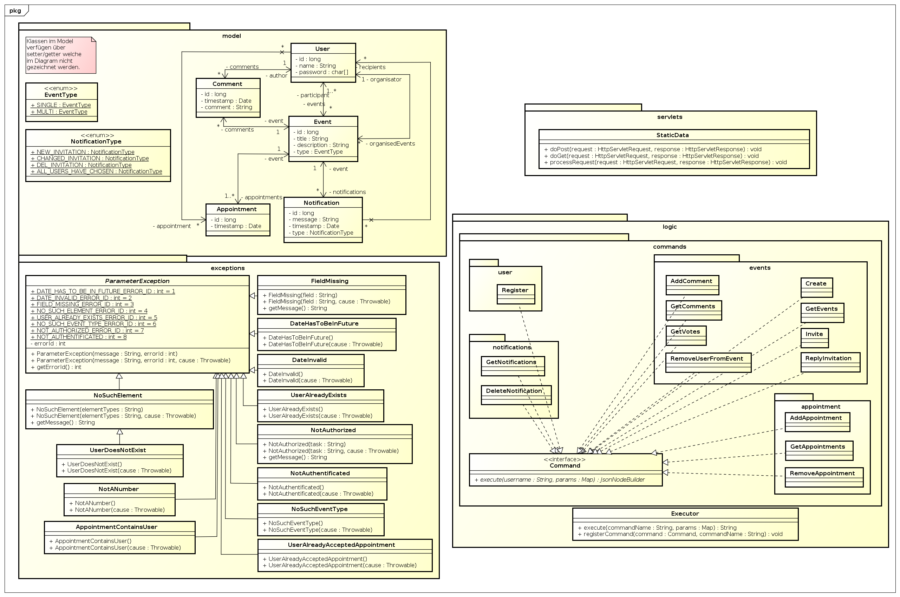

##########
BigPicture
##########

Internet calendar tool for time management, and coordinating meetings

======
Angabe
======

Es soll ein kollaboratives Terminvereinbarungssystem (ähnlich wie Doodle[2]_)
erstellt werden, in dem sich Benutzer koordinieren können. 

~~~~~~~~~~~~~~~~~~
Rollen & Entitäten
~~~~~~~~~~~~~~~~~~

--------
Benutzer
--------

* Neue Benutzer können sich registrieren
* Existierende Benutzer können sich einloggen
* Man kann nach registrierten Benutzern im System suchen (über ihren Namen).
* Ein Benutzer kann gleichzeitig ein Organisator und Teilnehmer sein.
* Jeder Benutzer kann sich die Events, die er organisiert, oder Events, an
  denen er teilnimmt, anzeigen lassen.

-----------
Organisator
-----------

* ist ein Benutzer, der Events mit Namen und mehreren Termin- und
  Zeitvorschlägen erstellt und die Einladungen an einige registrierte Benutzer
  schickt
* darf den Namen, die Termine und Zeiten eines Events ändern, aber nur bevor
  sich einer der Benutzer zu dem Event angemeldet hat
* darf neue Benutzer zu seinen Events zusätzlich einladen
* darf eingeladene Benutzer wieder löschen, bevor sich diese zu dem Event
  angemeldet haben
* darf die Events jederzeit löschen
* darf zu seinen Events Kommentare posten
* darf Kommentare zu seinen Events löschen (auch die von anderen Benutzern)
* Nachdem sich alle Benutzer zu einer Einladung angemeldet haben, darf der
  Organisator einen fixen Termin festlegen.

----------
Teilnehmer
----------

* wählt aus den vorgeschlagenen Terminen und Zeiten eines Events (eine Checkbox
  pro Zeitvorschlag reicht)
* darf seine Wahl ändern, bis ein fixer Termin existiert
* darf Kommentare zu Events, an denen er teilnimmt, posten

-------------
Notifications
-------------

* Ein Teilnehmer wird über jede neue/editierte/gelöschte Eventeinladung
  notifiziert.
* Weiters wird ein Teilnehmer notifiziert, sobald ein fixer Termin für ein
  Event festgelegt wird.
* Ein Organisator wird notifiziert, sobald sich alle Teilnehmer zu einem
  seiner Events angemeldet haben.
* Wenn ein Benutzer zur Zeit einer Notification offline ist, darf diese nicht
  verloren gehen. Der Benutzer bekommt alle seine versäumten Notifications,
  sobald er online kommt.

------
Events
------

es kann zwei Arten von Events geben

1. Events, bei denen sich die Teilnehmer auf (möglichst) einen Termin einigen
   sollen (Standardfall). Der Organisator legt letztendlich einen fixen Termin
   fest.
2. Events, bei denen jeweils nur ein Teilnehmer pro Termin erlaubt ist (z.B.
   für Elternsprechtag). Der Organisator muss jede
   Teilnehmer/Termin-Kombination fixieren.

~~~~~~~~~~~~~~~~
Aufgabenstellung
~~~~~~~~~~~~~~~~

Entwickeln Sie ein GUI-Programm, welches das Terminvereinbarungssystem
realisiert. Bei der Abgabe müssen Sie die Aufgabe auf mindestens drei
Rechnern (mit mehreren gleichzeitig gestarteten Clients) präsentieren.

Beim Starten des Programms müssen der gewünschte Benutzername und die
Netzwerkadresse des Servers angegeben werden (kein Passwort erforderlich).
Die Registrierung kann automatisch bei der ersten Anmeldung erfolgen.

Achten Sie bei der Implementierung auf die transaktionale Sicherheit. Überlegen
Sie sich Situationen, in denen z.B. ein Benutzer versucht, eine Terminwahl zu
einem in der Zwischenzeit gelöschten Event zu realisieren. Ihr Programm sollte
auf solche und ähnliche Situationen entsprechend reagieren.

Beachten Sie bei der Implementierung, dass die Kommentare in derselben
Reihenfolge aufgelistet werden müssen, in der diese von den einzelnen
Benutzern abgeschickt wurden.
Sie müssen sich auch Gedanken über die Persistenz der Informationen machen.
Wenn die Serverinstanz herunterfährt, muss der gesamte Inhalt dauerhaft
abgelegt worden sein.

Es reicht ein einfaches, aber funktionales GUI. Sie dafür Frameworks einsetzen.

--------------
Vorgehensweise
--------------

Es sind die Meta-Regeln zu beachten. Dabei ist zu beachten, dass nur durch eine
bligatorische Design-Review durch die unterrichtenden Lehrkräfte, das gewählte
Design (realisiert und vorgestellt mittels UML Diagrammen) verwendet werden
darf. Nachträgliche Änderungen müssen durch einen Change-Request genehmigt
werden. Diese müssen in eine Feature/Requirements Liste münden, die z.B. durch
User-Stories definiert werden können. Zu bedenken sind auch nicht-funktionale
Anforderungen an das System, wie z.B. die Anzeigegeschwindigkeit der ersten
Termine und Kommentare.

Des weiteren sind Programmier-Teams verpflichtend. Diese sind durch eine/n
Tester/in und eine/n Programmierer/in definiert. Angenommene Tasks der
einzelnen Stories werden gleichzeitig(!) vom Tester und Programmierer
behandelt, wobei der Tester die Anforderungen in z.B. Unit-Tests und der
Programmierer in den entsprechenden Codeteilen implementiert. Dabei soll
sichergestellt sein, dass sofort geeignete Testfälle den gerade eben
implementierten Code auf dessen Funktionstüchtigkeit überprüfen.

Integrations- und Systemtests sind verpflichtend. Dabei sind in diesem Fall
auch automatisierte GUI-Tests zu verwirklichen. Der Testbericht im Protokoll
muss auch eine kontinuierliche Verbesserung der zu erzielenden Storypoints
ersichtlich machen.

-------
Termine
-------

* 9.5.2014 AdS: Design Review - Deadline für Design der Applikation!
* 5.6.2014 23:55: Deadline Abgabe (fix - keine Verlängerung möglich!)
* 6.6.2014: Abnahme Interview (15min / Gruppe)

Dazwischen müssen die Teamleader wöchentlich einen Reviewtermin selbstständig
wahrnehmen.

-------------------
Bewertungskriterien
-------------------

* Dokumentation
* Design
* Implementierung
* Funktionalität
* Tests/System

=======
Planung
=======

~~~~~~~~~~~~~~
Klassendiagram
~~~~~~~~~~~~~~

~~~~~~~~~~~~~~~
Event Livecycle
~~~~~~~~~~~~~~~

.. image:: doc/EventZustandsDiagramm.png
  :width: 70%

~~~~~~~~~~~~~~~~~~~~~~~~~~~
Client-Server-Kommunikation
~~~~~~~~~~~~~~~~~~~~~~~~~~~

Kommunikation zwischen Client und Server soll auf REST Anfrage mit 
JSON Antworten basieren. Die 
Entscheidung ist auf diese Technik gefallen da sie besonders einfach zu 
implementieren ist und denoch eine wohl strukturierte Kommunikation 
ermöglicht.

------------
Appointments
------------

==================== ==================== =====================================
 Method               Params               Response
==================== ==================== =====================================
addAppointment
                     - timestamp
                     - eventName
getAppointments
                                          - error:

                                            * ""
                                            * "NotAuthentificated"
removeAppointment
                     - timestamp
                     - eventName
==================== ==================== =====================================

------
Events
------

==================== ==================== =====================================
 Method               Params               Response
==================== ==================== =====================================
addComment
                     - eventName          - error
                     - content
                                            * ""
                                            * "No such event."
                                            * "Empty title."
                                            * "Empty content."
create
                     - eventName          - error:
                     - eventType
                                            * ""
                                            * "Empty eventName."
                                            * "No such eventType."
getComments
                     - eventName          - error

                                            * ""
                                            * "No such event."

                                          - comments:

                                            [{title, content, timestamp}, ...]
getEvents
getVotes
                     - eventName          - error

                                            * ""
                                            * "No such event."
invite
                     - eventName          - error:
                     - date
                     - username             * ""
                                            * "No such event."
                                            * "User <username> does not exist."
                                            * "Not authorized to invite users
                                              to this event."
                                            * "Date has to be in the future."
removeUserFromEvent
                     - eventName          - error
                     - username
                                            * ""
                                            * "UserDoesNotExist"
                                            * "NoSuchElement"
replyInvitation
                     - eventName          - error:
                     - accept
                                            * ""
                       true/false           * "No such event."
==================== ==================== =====================================

------------
Notification
------------

==================== ==================== =====================================
 Method               Params               Response
==================== ==================== =====================================
deleteNotification
                     - notificationId     - error:

                                            * ""
                                            * "No such notification."
getNotifications
                                          {id1:message1, id2:message2, ...}

                                          * id: long
                                          * message: String
==================== ==================== =====================================

----
User
----

==================== ==================== =====================================
 Method               Params               Response
==================== ==================== =====================================
findUser
                     - userPattern
register
                     - username           - error:
                     - password                  
                                            * ""
                                            * "User does already exist"
==================== ==================== =====================================

======
Server
======

Der Server wird in Java implementiert. Zur Kommunikation zu den Clients wird
wird die JSON-RPC Library *JSON-RPC 2.0 Base* [4]_ verwendet.

Daten werden Serverseitig in Datenbanken persistiert. Als Bibliothek zum
Zugriff auf die Datenbank wird *Hibernate* [5]_ verwendet. Da Hibernate 
verwendet wird, muss nicht näher spezifiziert werden welches RDBMS verwendet
wird.

======
Client
======

Der Client wird als Webapplikation mit HTML, Javascript, CSS implementiert.
Die Kommunikation zum Server erfolgt über JQuery, da hier bereits ein großes
Angebot an verwendbaren Libaries besteht.

~~~~~~~~~~~~~~~~~~~~~~~~~~~~~~~~
JQuery - Technologiebeschreibung
~~~~~~~~~~~~~~~~~~~~~~~~~~~~~~~~

jQuery ist ein von John Resig entwickeltes, frei verfügbares Javascript-Framework,
das über sehr umfangreiche und mächtige Funktionen zur Navigation und Manipulation
der DOM-Syntax bereit stellt.
Vor allem die vereinfachte Navigation und Einbindung gehören zu den Stärken des JS-Programmiergerüsts.
Des Weiteren bietet das Framework elegante und leicht verständliche Funktionen für animierte Effekte,
Ajax und Event-Handling. [7]_

~~~~~~~~~~
GUI Design
~~~~~~~~~~

---------
Übersicht
---------

.. image:: doc/skizze-webinterface.jpg
  :width: 60%

-----
Login
-----

.. image:: doc/skizze_login.jpg
  :width: 60%
  
-----------------
Event-Erstelllung
-----------------

================
Aufwandschätzung
================

+----------------+------------------------------+-----------+---------+---------------+
| Paket          | Aufgabe                      | Schätzung | Aufwand |Zuständiger    |
+================+==============================+===========+=========+===============+
| Organisation   |                              |     05:00 |         |               |
+----------------+------------------------------+-----------+---------+---------------+
| Networking     | Planung                      |     03:00 |         | Jakob Klepp   |
+----------------+------------------------------+-----------+---------+---------------+
| Networking     | JSON-RPC Server Seite        |     03:00 |         | Jakob Klepp   |
+----------------+------------------------------+-----------+---------+---------------+
| Networking     | Schnittstellen Server Seite  |     02:00 |         | Jakob Klepp   |
+----------------+------------------------------+-----------+---------+---------------+
| Networking     | JSON-RPC Client Seite        |     01:30 |         | Martin Haidn  |
+----------------+------------------------------+-----------+---------+---------------+
| Server         | Logik                        |     02:00 |         | Daniel Djuric |
+----------------+------------------------------+-----------+---------+---------------+
| Persistance    |                              |           |         | Daniel Djuric |
+----------------+------------------------------+-----------+---------+---------------+
| Persistance    | Hibernate Domain Model       |     01:30 |         | Daniel Djuric |
+----------------+------------------------------+-----------+---------+---------------+
| Webinterface   | Login                        |     01:30 |         | Martin Haidn  |
+----------------+------------------------------+-----------+---------+---------------+
| Webinterface   | Kalender                     |     02:00 |         | Martin Haidn  |
+----------------+------------------------------+-----------+---------+---------------+
| Webinterface   | Voting                       |     02:00 |         | Martin Haidn  |
+----------------+------------------------------+-----------+---------+---------------+
| Webinterface   | Event Managing               |     03:00 |         | Martin Haidn  |
+----------------+------------------------------+-----------+---------+---------------+

================
Zeitaufzeichnung
================

+-------------------------------+---------------+-------------------+---------+---------+----------+
| Task                          | Date          | Who               | From    | To      | Duration |
+===============================+===============+===================+=========+=========+==========+
| Planung                       | 2014-04-25    | Martin Haidn      |  10:40  |  12:20  |     1:40 |
+-------------------------------+---------------+-------------------+---------+---------+----------+
| Planung                       | 2014-04-25    | Jakob Klepp       |  10:40  |  12:20  |     1:40 |
+-------------------------------+---------------+-------------------+---------+---------+----------+
| Planung                       | 2014-04-25    | Daniel Djuric     |  10:40  |  12:20  |     1:40 |
+-------------------------------+---------------+-------------------+---------+---------+----------+
| Angabe in Doku eingefügt      | 2014-04-25    | Jakob Klepp       |  10:20  |  12:40  |     0:20 |
+-------------------------------+---------------+-------------------+---------+---------+----------+
| Planung der Client-Server API | 2014-05-03    | Jakob Klepp       |  14:00  |  14:45  |     0:45 |
+-------------------------------+---------------+-------------------+---------+---------+----------+
| Planung der Client-Server API | 2014-05-03    | Jakob Klepp       |  19:45  |  21:00  |     1:15 |
+-------------------------------+---------------+-------------------+---------+---------+----------+
| Koordination                  | 2014-05-05    | Martin Haidn      |  15:10  |  15:40  |     0:30 |
+-------------------------------+---------------+-------------------+---------+---------+----------+
| Koordination                  | 2014-05-05    | Jakob Klepp       |  15:10  |  15:40  |     0:30 |
+-------------------------------+---------------+-------------------+---------+---------+----------+
| Koordination                  | 2014-05-05    | Daniel Djuric     |  15:10  |  15:40  |     0:30 |
+-------------------------------+---------------+-------------------+---------+---------+----------+
| JSON-RPC - JQuery Evaluierung | 2014-05-05    | Martin Haidn      |  21:10  |  22:10  |     1:00 |
+-------------------------------+---------------+-------------------+---------+---------+----------+
| Erläuterung JSON-RPC          | 2014-05-05    | Jakob Klepp       |  15:50  |  15:55  |     0:05 |
+-------------------------------+---------------+-------------------+---------+---------+----------+
| ZustandsDiagramm Event        | 2014-05-08    | Djuric Daniel     |  08:30  |  09:40  |     1:10 |
+-------------------------------+---------------+-------------------+---------+---------+----------+
| GUI Desing, Kalender Test     | 2014-05-05    | Martin Haidn      |  15:05  |  16:05  |     1:00 |
+-------------------------------+---------------+-------------------+---------+---------+----------+
| Planung                       | 2014-05-07    | Jakob Klepp       |  15:15  |  16:20  |     1:05 |
+-------------------------------+---------------+-------------------+---------+---------+----------+
| KlassenDiagramm erweitert     | 2014-05-07    | Djuric Daniel     | 15:30   |  16:05  |     0:35 |
+-------------------------------+---------------+-------------------+---------+---------+----------+
| Aufwandschätzung, Draft       | 2014-05-08    | Jakob Klepp       |  10:20  |  10:35  |     0:15 |
+-------------------------------+---------------+-------------------+---------+---------+----------+
| Aufwandschätzung              | 2014-05-08    | Martin Haidn      |  18:40  |  18:50  |     0:10 |
+-------------------------------+---------------+-------------------+---------+---------+----------+
| GUI-Planung, Dokumentation    | 2014-05-08    | Martin Haidn      |  21:10  |  22:30  |     1:20 |
+-------------------------------+---------------+-------------------+---------+---------+----------+
| Klassendiagram                | 2014-05-09    | Jakob Klepp       |  09:00  |  09:45  |     0:45 |
+-------------------------------+---------------+-------------------+---------+---------+----------+
| JQuery-Technologie, Doku      | 2014-05-09    | Martin Haidn      |  09:55  | 10:15   |     0:20 |
+-------------------------------+---------------+-------------------+---------+---------+----------+
| Vorbereitung Präsentation     | 2014-05-09    | Jakob Klepp       |  09:55  |  10:15  |     1:20 |
+-------------------------------+---------------+-------------------+---------+---------+----------+
| Schadenbegrenzung .RST GAU    | 2014-05-09    | Martin Haidn      |  10:15  |  10:45  |     0:30 |
+-------------------------------+---------------+-------------------+---------+---------+----------+
| Schadenbegrenzung .RST GAU    | 2014-05-09    | Jakob Klepp       |  10:15  |  10:45  |     0:30 |
+-------------------------------+---------------+-------------------+---------+---------+----------+
| Zeitaufzeichnung              | 2014-05-09    | Djuric Daniel     |  10:15  |  10:45  |     0:30 |
+-------------------------------+---------------+-------------------+---------+---------+----------+
| Usecase Diagramm              | 2014-05-09    | Martin Haidn      |  10:45  |  12:00  |     1:15 |
+-------------------------------+---------------+-------------------+---------+---------+----------+
| Webdesign                     | 2014-05-09    | Martin Haidn      |  12:00  |  12:20  |     0:20 |
+-------------------------------+---------------+-------------------+---------+---------+----------+
| Präsentation + verarbeitung   | 2014-05-09    | Jakob Klepp       |  10:45  |  12:20  |     0:35 |
| feedback                      |               |                   |         |         |          |
+-------------------------------+---------------+-------------------+---------+---------+----------+
| REST - Evaluierung            | 2014-05-10    | Martin Haidn      |  08:00  |  09:00  |     1:00 |
+-------------------------------+---------------+-------------------+---------+---------+----------+
| Auseinandersetzung der README | 2014-05-12    | Matthias El-Far   |  9:20   |  10:00  |     0:40 |
+-------------------------------+---------------+-------------------+---------+---------+----------+
| Change Request 001            | 2014-05-12    | Jakob Klepp       |  23:00  |  00:15  |     1:15 |
+-------------------------------+---------------+-------------------+---------+---------+----------+
| Change Request 001            | 2014-05-13    | Jakob Klepp       |  00:15  |  00:25  |     0:10 |
+-------------------------------+---------------+-------------------+---------+---------+----------+
| Hibernate implementiert       | 2014-05-22    | Djuric Daniel     |  11:40  |  13:20  |     1:40 |
+-------------------------------+---------------+-------------------+---------+---------+----------+
| GUI-Realisierung Main-View    | 2014-05-22    | Martin Haidn      |  11:40  |  13:20  |     1:40 |
+-------------------------------+---------------+-------------------+---------+---------+----------+
| Präsentation + verarbeitung   | 2014-05-23    | Jakob Klepp       |  10:00  |  11:40  |     1:40 |
| feedback                      |               |                   |         |         |          |
+-------------------------------+---------------+-------------------+---------+---------+----------+
| Hibernate verbessert und      | 2014-05-23    | Djuric Daniel     |  09:50  |  12:20  |     2:30 |
| Model ausgebessert            |               |                   |         |         |          |
+-------------------------------+---------------+-------------------+---------+---------+----------+
| Dropdownmenu hinzugefuegt und |               |                   |         |         |          |
| Event view begonnen           | 2014-05-23    | Martin Haidn      |  09:50  |  12:20  |     2:30 |
+-------------------------------+---------------+-------------------+---------+---------+----------+
| Automatisches deployment      | 2014-05-26    | Jakob Klepp       |  11:15  |  11:45  |     0:30 |
+-------------------------------+---------------+-------------------+---------+---------+----------+
| Probleme mit Tomcat           | 2014-05-26    | Jakob Klepp       |  15:30  |  17:30  |     2:00 |
| umstellen auf Jetty           |               |                   |         |         |          |
+-------------------------------+---------------+-------------------+---------+---------+----------+
| Eventview, Calendar-Callbacks | 2014-05-27    | Martin Haidn      |  10:20  |  11:30  |     1:10 |
+-------------------------------+---------------+-------------------+---------+---------+----------+
| Events mittels eigener Event- | 2014-05-28    | Martin Haidn      |  17:30  |  19:30  |     2:00 |
| View hinzufügen               |               |                   |         |         |          |
+-------------------------------+---------------+-------------------+---------+---------+----------+
| Servlet reparieren            | 2014-05-29    | Jakob Klepp       |  10:30  |  11:45  |     1:15 |
+-------------------------------+---------------+-------------------+---------+---------+----------+
| Hibernate ausgebessert        | 2014-05-29    | Djuric Daniel     |  11:00  |  15:00  |     4:00 |
+-------------------------------+---------------+-------------------+---------+---------+----------+
| Login-Screen / Main-View      | 2014-05-29    | Martin Haidn      |  10:30  |  16:30  |     6:00 |
+-------------------------------+---------------+-------------------+---------+---------+----------+
| REST-Übertragung              | 2014-05-29    | Martin Haidn      |  10:30  |  16:30  |     6:00 |
+-------------------------------+---------------+-------------------+---------+---------+----------+
| Events in                     | 2014-05-29    | Martin Haidn      |         |         |          |
| in Kalender anzeigen          |               |                   |  17:10  |  19:00  |     1:50 |
+-------------------------------+---------------+-------------------+---------+---------+----------+
| Anmelde Formular finalisiert  | 2014-05-29    | Matthias El-Far   |  13:00  |  16:30  |     3:30 |
+-------------------------------+---------------+-------------------+---------+---------+----------+
| Informiert über JQuery        | 2014-05-29    |  Matthias El-Far  |  17:00  |  18:30  |     1:30 |
+-------------------------------+---------------+-------------------+---------+---------+----------+
| EventDayText reset            | 2014-05-29    |  Matthias El-Far  |  18:30  |  19:00  |     0:30 |
+-------------------------------+---------------+-------------------+---------+---------+----------+
| Testdaten erzeugen & debuggen | 2014-05-29    | Jakob Klepp       |  11:45  |  16:30  |     4:15 |
+-------------------------------+---------------+-------------------+---------+---------+----------+
| Commandpattern & Executor     | 2014-05-29    | Jakob Klepp       |  17:10  |  19:00  |     1:50 |
+-------------------------------+---------------+-------------------+---------+---------+----------+
| Testdatensaetze hinzugefuegt  | 2014-05-30    | Djuric Daniel     |  10:00  |  12:20  |     2:20 |
+-------------------------------+---------------+-------------------+---------+---------+----------+
| erzeugen des PDF gradlen      | 2014-05-31    | Jakob Klepp       |  16:00  |  17:00  |     1:00 |
+-------------------------------+---------------+-------------------+---------+---------+----------+
| Hibernate auf JPA porten      | 2014-06-01    | Jakob Klepp       |  21:30  |  22:45  |     1:15 |
+-------------------------------+---------------+-------------------+---------+---------+----------+
| GetEvents Implementation      | 2014-06-02    | Jakob Klepp       |  00:00  |  01:30  |     1:30 |
+-------------------------------+---------------+-------------------+---------+---------+----------+
| Abfragen implementiert        | 2014-06-02    | Djuric Daniel     |  22:30  |  02:00  |     3:30 |
+-------------------------------+---------------+-------------------+---------+---------+----------+
| Create Implementation         | 2014-06-02    | Jakob Klepp       |  01:30  |  02:00  |     0:30 |
+-------------------------------+---------------+-------------------+---------+---------+----------+
| Invite Implementation         | 2014-06-02    | Jakob Klepp       |  02:05  |  02:15  |     0:10 |
+-------------------------------+---------------+-------------------+---------+---------+----------+
| AddComment Implementation     | 2014-06-02    | Jakob Klepp       |  02:15  |  02:30  |     0:15 |
+-------------------------------+---------------+-------------------+---------+---------+----------+
| Abfragen                      | 2014-06-02    | Djuric Daniel     |  10:40  |  12:00  |     1:20 |
+-------------------------------+---------------+-------------------+---------+---------+----------+
| Commands aufräumen/ergänzen   | 2014-06-02    | Jakob Klepp       |  11:00  |  12:00  |     1:00 |
+-------------------------------+---------------+-------------------+---------+---------+----------+
| AddComment Implementation     | 2014-06-02    | Jakob Klepp       |  14:30  |  14:45  |     0:15 |
+-------------------------------+---------------+-------------------+---------+---------+----------+
| JUnit tests                   | 2014-06-02    | Jakob Klepp       |  15:00  |  16:50  |     1:50 |
+-------------------------------+---------------+-------------------+---------+---------+----------+
| Junit tests logik             | 2014-06-03    | Djuric Daniel     |  14:30  |  17:00  |     2:30 |
+-------------------------------+---------------+-------------------+---------+---------+----------+
| JUnit tests                   | 2014-06-03    | Jakob Klepp       |  11:30  |  12:15  |     0:45 |
+-------------------------------+---------------+-------------------+---------+---------+----------+
| model remodelled              | 2014-06-03    | Jakob Klepp       |  14:20  |  19:00  |     4:40 |
+-------------------------------+---------------+-------------------+---------+---------+----------+
| JUnit tests                   | 2014-06-03    | Jakob Klepp       |  19:10  |  20:10  |     1:00 |
+-------------------------------+---------------+-------------------+---------+---------+----------+
| JUnit tests logik             | 2014-06-04    | Djuric Daniel     |  09:00  |  09:40  |     0:40 |
+-------------------------------+---------------+-------------------+---------+---------+----------+
| JUnit tests                   | 2014-06-04    | Djuric Daniel     |  15:00  |  20:30  |     5:30 |
+-------------------------------+---------------+-------------------+---------+---------+----------+
<<<<<<< HEAD
=======
| Bug Suche                     | 2014-06-04    | Jakob Klepp       |  14:50  |  15:50  |     1:00 |
+-------------------------------+---------------+-------------------+---------+---------+----------+
| GetComments                   | 2014-06-04    | Jakob Klepp       |  15:50  |  16:05  |     0:15 |
+-------------------------------+---------------+-------------------+---------+---------+----------+
| GetAppointments               | 2014-06-04    | Jakob Klepp       |  16:05  |  16:35  |     0:30 |
+-------------------------------+---------------+-------------------+---------+---------+----------+
| Invite                        | 2014-06-04    | Jakob Klepp       |  17:35  |  18:25  |     0:50 |
+-------------------------------+---------------+-------------------+---------+---------+----------+
| ReplyInvitation               | 2014-06-04    | Jakob Klepp       |  18:25  |  20:00  |     1:35 |
+-------------------------------+---------------+-------------------+---------+---------+----------+
| UML                           | 2014-06-04    | Jakob Klepp       |  20:00  |  20:20  |     0:20 |
+-------------------------------+---------------+-------------------+---------+---------+----------+
| GetNotifications security     | 2014-06-04    | Jakob Klepp       |  20:20  |  20:40  |     0:20 |
+-------------------------------+---------------+-------------------+---------+---------+----------+
| Einbinden des DateTimePickers | 2014-06-04    | Martin Haidn      |  15:00  |  18:00  |     3:00 |
+-------------------------------+---------------+-------------------+---------+---------+----------+
| Viewupdate, Hinzufuegen und   | 2014-06-04    | Martin Haidn      |  18:30  |  20:40  |     2:10 |
| Ändern von Terminen über View |               |                   |         |         |          |
+-------------------------------+---------------+-------------------+---------+---------+----------+
| DeleteNotification            | 2014-06-04    | Jakob Klepp       |  23:25  |  23:40  |     0:15 |
| Eventview Erweiterung /       | 2014-06-04    | Martin Haidn      |  21:00  |  23:00  |     2:00 |
| Basic Authentification        |               |                   |         |         |          |
+-------------------------------+---------------+-------------------+---------+---------+----------+
| DeleteNotification            | 2014-06-04    | Jakob Klepp       |  23:25  |  23:40  |     0:15 |
+-------------------------------+---------------+-------------------+---------+---------+----------+
| TODO                          | 2014-06-04    | Jakob Klepp       |  23:40  |  23:50  |     0:10 |
+-------------------------------+---------------+-------------------+---------+---------+----------+
| Selenium Tests                | 2014-06-02    | Matthias El-Far   |  09:50  |  12:30  |     2:40 |
+-------------------------------+---------------+-------------------+---------+---------+----------+
| Selenium Tests                | 2014-06-02    | Matthias El-Far   |  17:00  |  18:00  |     1:00 |
+-------------------------------+---------------+-------------------+---------+---------+----------+
| Selenium Tests                | 2014-06-03    | Matthias El-Far   |  08:00  |  12:30  |     4:30 |
+-------------------------------+---------------+-------------------+---------+---------+----------+
| Event GUI Überarbeitet        | 2014-06-04    | Matthias El-Far   |  12:30  |  17:30  |     5:00 |
+-------------------------------+---------------+-------------------+---------+---------+----------+
| FindUser                      | 2014-06-05    | Jakob Klepp       |  08:15  |  08:55  |     0:40 |
+-------------------------------+---------------+-------------------+---------+---------+----------+
| RemoveUserFromEvent           | 2014-06-05    | Jakob Klepp       |  08:55  |  09:40  |     0:45 |
+-------------------------------+---------------+-------------------+---------+---------+----------+
>>>>>>> 093a9298a3df56ed6e68dd5db5decbb384ee76a4

+-------------------+------------+
| Jakob Klepp       |      41:15 |
+-------------------+------------+
| Martin Haidn      |      31:25 |
+-------------------+------------+
| Daniel Djuric     |      27:05 |
+-------------------+------------+
| Mathias El-Far    |      19:20 |
+-------------------+------------+
| **Sum:**          | **119:05** |
+-------------------+------------+

=======
Quellen
=======

.. _1:

[1]  Moodle: Angabe/Abgabe
     http://elearning.tgm.ac.at/mod/assign/view.php?id=22219
     zuletzt besucht am: 2014-04-25

.. _2:

[2]  Doodle
     http://doodle.com
     zuletzt besucht am: 2014-04-25

.. _3:

[3]  JSON-RPC
     https://en.wikipedia.org/wiki/JSON-RPC
     zuletzt besucht am: 2014-05-05

.. _4:

[4]  JSON-RPC 2.0 : Base
     http://software.dzhuvinov.com/json-rpc-2.0-base.html
     zuletzt besucht am: 2014-05-07

.. _5:

[5]  jQuery Learning Center
     https://learn.jquery.com/
     zuletzt besucht am: 2014-05-07

.. _6:

[6]  Hibernate
     http://hibernate.org/
     zuletzt besucht am: 2014-05-07

.. _7:

[7]  JQuery: Angabe/Abgabe
     http://www.ajaxschmiede.de/jquery/jquery-ein-machtiges-und-effizientes-werkzeug/
     zuletzt besucht am: 2014-05-09

.. header::

    +-------------+-------------------+------------+
    | ###Title### | Jakob Klepp,      | 2014-05-30 |
    |             | Martin Haidn,     |            |
    |             | Daniel Djuric,    |            |
    |             | Mathias El-Far    |            |
    +-------------+-------------------+------------+

.. footer::

    ###Page### / ###Total###
